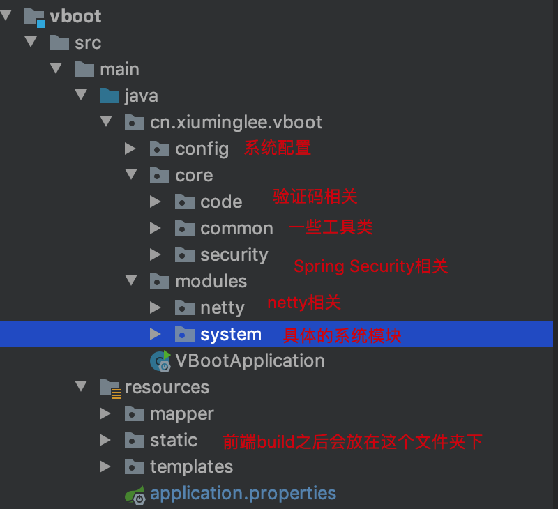

# VBoot后台管理系统使用手册

## 1、目录结构

- ##### 后端目录结构



## 2、运行

### 1、前后端分别启动

- ##### 前端启动

执行`npm serve`，前端默认会在`8080`端口启动。

可以通过`package.json`文件修改。

- ##### 后端启动

直接运行`VBootApplication`类主方法即可。默认是`8081`端口。

> **注意：**如果是以前后端分别启动方法运行的项目，如果后端修改了端口后，前端需要在`vue.config.js`中修改请求代理转发的端口。

### 2、前端打包到后端启动

执行`npm build`，前端编译后的代码会被放到后端代码的`resources/static`文件夹下，此时运行`VBootApplication`直接浏览器中访问`http://localhost:8081/`即可。

## 3、关于Netty服务

这里使用Netty完全是为了用Netty而用Netty，这种小小的聊天功能使用Spring Websocket足够，但是当时学习了Netty就行运用一下。

这里Netty服务的端口，默认是`8088`，后端可以通过配置文件`vboot.netty-server-port`修改。相应的后端修改后，前端也需要在`src/config/index.js`中修改。

## 4、头像上传和邮件功能

> **以下两项不配置并不影响系统整体功能的使用。**

### 头像上传

当初实现的时候，只提供了七牛云的上传接口，所以如果使用的话需要设置自己七牛云的相关设置。

```properties
# 这样开启七牛云功能
vboot.vboot.file-upload-type=qiniu 
# 填写自己的七牛云信息
vboot.qiniu.access-key=
vboot.qiniu.secret-key=
vboot.qiniu.prefix-path=
vboot.qiniu.folder=
vboot.qiniu.bucket-name=
```

> **`后期会将上传文件抽象出来，提供多种实现方式。`**

### 邮件功能

这里的邮箱功能只是在用户个人信息中绑定或修改邮箱功能用到了，如果你想测试邮箱功能需要设置自己的邮箱账号。

```properties
## 邮箱相关
spring.mail.username=
spring.mail.password=
spring.mail.host=smtp.qq.com
#需要注意的是qq邮箱需要安全项所以要多配置以下参数
spring.mail.properties.mail.smtp.ssl.enable=true
```

## 5、后期的计划

- 优化重构代码
- 将后端代码分成多模块，使结果更加清晰
- 将相关功能进行抽象，使其更加灵活。
- ....

